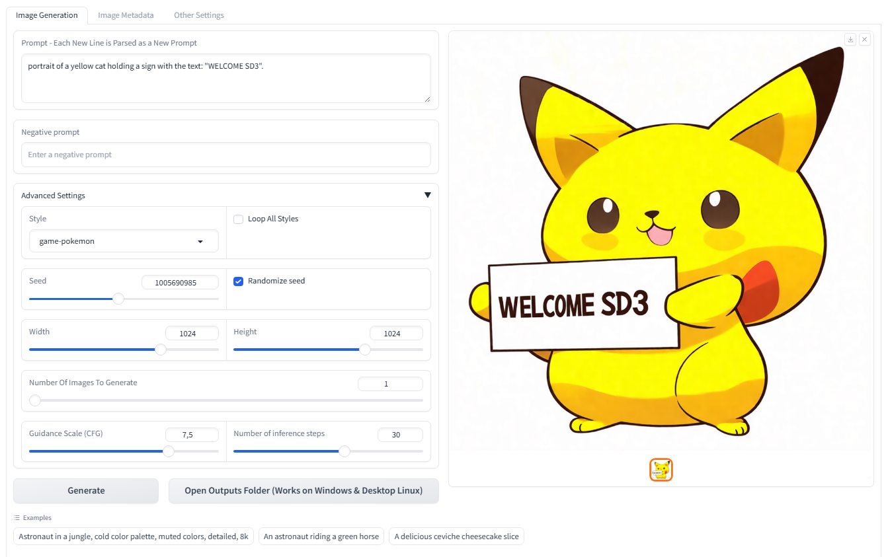

<div align="center">
<h1>Stable Diffusion 3 WebApp Gradio Demo</h1>
</div>

<div align="center">

</div>

## About
This project is a Beta version to support and execute the new Stability.ai model - Stable Diffusion 3 Medium. Suggestions for improvements are welcome!

We implemented optimization improvements for local execution such as CPU offloading and quantization of the transformer model and the T5 text-encoder.

## Local Instalation
Then run the following command at the command prompt:
```bash
git clone https://github.com/DEVAIEXP/SD3.git
cd SD3

#to create virtual env
python -m venv venv 
(on linux)
source venv/bin/activate 
(on windows)
.\venv\Scripts\activate.bat

#continue installing requirements
pip install torch==2.2.0 torchvision torchaudio --index-url https://download.pytorch.org/whl/cu121 --upgrade
pip install bitsandbytes==0.43.1 --upgrade
pip install -r requirements.txt
```

## Running locally
```bash
#normal run without quantization full 16bit precision
python app.py

#to enable CPU offloading, pass the --lowvram parameter to start. Note: Do not use this parameter in conjunction with the parameters below:
python app.py --lowvram

#to quantize MMDiT model pass the --mmdit_load_mode parameter to start with values 8bit or 4bit
python app.py --mmdit_load_mode=8bit

#to quantize T5-XXL text_encoder model pass the --t5_load_mode parameter to start with values 8bit or 4bit
python app.py --t5_load_mode=8bit

#or together if you are going to quantize both
python app.py --mmdit_load_mode=8bit --t5_load_mode=8bit 
```

## Quantization Comparison
Below is a matrix that presents the results of the images applying the quantization of the MMDiT model and the T5-XXL:


| MMDiT/T5-XXL<br> precision | 16bit | 8bit | 4bit 
|:-----:|:-----:|:-----:|:-----:|
16bit |   |  |  |
8bit  |   |  |  |
4bit  |   | |  |


## Star History
[](https://star-history.com/#DEVAIEXP/SD3&Date)


## License
This project is released under the [Apache License 2.0](LICENSE).

## Contact
If you have any questions, please contact: contact@devaiexp.com